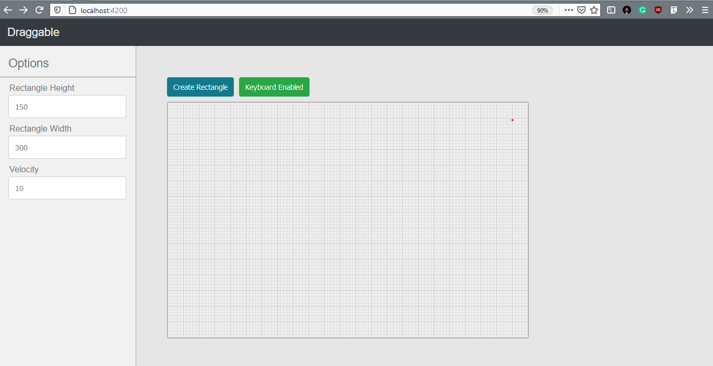

# Drawable

## Guide
- User gets to see a button to add a new box in the window. On clicking the button, a box
is created with a unique number ID. Boxes are of fixed width and height.
- Higher id boxes will have a higher z-index.
- Users can add multiple boxes.
- To select a box, click on it. Highlight the selected box.
- Use W-A-S-D or arrow keys on the keyboard to move the selected box.
- Use the ‘delete’ key on the keyboard to remove the selected box.
- A button to toggle keyboard control.(*no listener should be open when this button status
is off).
- No NPM library is used to achieve this behaviour.

## Bonus Features
- Hardcoded custom rectangular fence and ensure all the boxes stay within the
fence during movement
- Optimized the UI and modularize your code.
## Development server
- Run `ng serve` for a dev server.
- Navigate to `http://localhost:4200/`. The app will automatically reload if you change any of the source files.

## Build

Run `ng build` to build the project.
The build artifacts will be stored in the `dist/` directory. Use the `--prod` flag for a production build.
